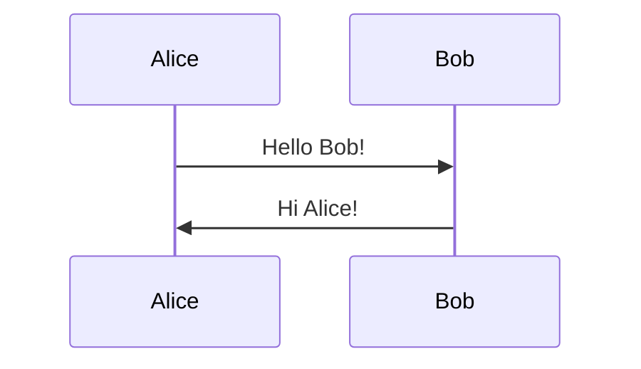

# MDtoPDF

**A free, privacy-focused Markdown editor that lives in your browser.**

Write Markdown. See it rendered instantly. Export to PDF, Word, or HTML. No signup. No ads. No tracking.

---

## What is this?

MDtoPDF is a web-based Markdown editor designed for people who want a simple, distraction-free writing experience. It's perfect for:

- **Writers** creating documents, articles, or blog posts
- **Developers** documenting code with syntax highlighting
- **Students** taking notes and exporting to PDF for assignments
- **Teams** sharing documentation in multiple formats

The app runs entirely in your browser with a server handling only the export conversions. Your content stays private.

---

## Why MDtoPDF?

### It's Free & Open Source
No premium tiers, no hidden fees, no "upgrade now" popups. The entire codebase is open source.

### No Account Required
Just open the app and start writing. No email, no password, no verification.

### Your Content Stays Yours
We don't store your documents. Everything lives in your browser until you export it. No cloud sync, no data collection.

### Professional Exports
Generate publication-ready PDFs with proper formatting, page numbers, and styled code blocks. Word documents that actually look good. Clean HTML for web publishing.

### Mermaid Diagrams Built-in
Create flowcharts, sequence diagrams, Gantt charts, and more right in your Markdown:

````markdown

````

### Dark & Light Themes
Easy on the eyes, day or night. One click to switch.

---

## Getting Started

### Use the Live Version

Visit the hosted version and start writing immediately:
- **URL**: [https://markdown-editor-viewer.onrender.com](https://markdown-editor-viewer.onrender.com)

### Run Locally

```bash
# Clone the repo
git clone https://github.com/yourusername/md-to-pdf.git
cd md-to-pdf

# Install and run
npm install
npm start

# Open http://localhost:3000
```

### Run with Docker

```bash
docker build -t md-to-pdf .
docker run -p 3000:3000 md-to-pdf
```

---

## How to Use

### Writing

1. Type or paste Markdown in the left editor
2. Watch it render in real-time on the right
3. Drag and drop `.md` files to open them

### Exporting

Click **Export** and choose your format:

| Format | Best For |
|--------|----------|
| **PDF** | Printing, sharing, archiving |
| **Word (DOCX)** | Editing in Microsoft Word, Google Docs |
| **HTML** | Web publishing, email newsletters |
| **Markdown** | Backup, version control, other editors |

---

## Features at a Glance

| Feature | Description |
|---------|-------------|
| Live Preview | See rendered output as you type |
| Syntax Highlighting | 180+ languages supported |
| Mermaid Diagrams | Flowcharts, sequences, Gantt charts |
| Tables | Full GitHub-flavored table support |
| Dark/Light Mode | Toggle anytime |
| Unicode Support | Japanese, Chinese, emoji, etc. |
| Drag & Drop | Open .md files instantly |
| Word Count | Track document length |
| Responsive | Works on mobile, tablet, desktop |

---

## Keyboard Shortcuts

| Shortcut | Action |
|----------|--------|
| `Ctrl/Cmd + S` | Save focus (prevents accidental navigation) |
| `Ctrl/Cmd + E` | Open export menu |

---

## Self-Hosting

Deploy your own instance for free on Render, Railway, Fly.io, or any Node.js host.

See [DEPLOYMENT.md](DEPLOYMENT.md) for step-by-step instructions.

---

## Tech Stack

Built with proven, reliable technologies:

- **Express.js** - Fast, minimal web server
- **Puppeteer** - Chrome-powered PDF generation
- **marked** - Markdown parsing
- **Mermaid.js** - Diagram rendering
- **highlight.js** - Code syntax highlighting
- **docx** - Word document generation

---

## API

Programmatic access for automation:

```bash
# Export Markdown to PDF
curl -X POST http://localhost:3000/export/pdf \
  -H "Content-Type: application/json" \
  -d '{"html": "<h1>Hello World</h1>", "title": "document"}'

# Export Markdown to Word
curl -X POST http://localhost:3000/export/docx \
  -H "Content-Type: application/json" \
  -d '{"markdown": "# Hello World", "title": "document"}'
```

---

## Contributing

Found a bug? Have a feature idea? Contributions welcome!

1. Fork the repo
2. Create a branch: `git checkout -b my-feature`
3. Commit: `git commit -m 'Add feature'`
4. Push: `git push origin my-feature`
5. Open a Pull Request

---

## License

MIT License - use it however you want.

---

## Support

If this tool saves you time, consider supporting development:

[](https://buymeacoffee.com/isidronelsw)

---

*Write simply. Export beautifully.*
